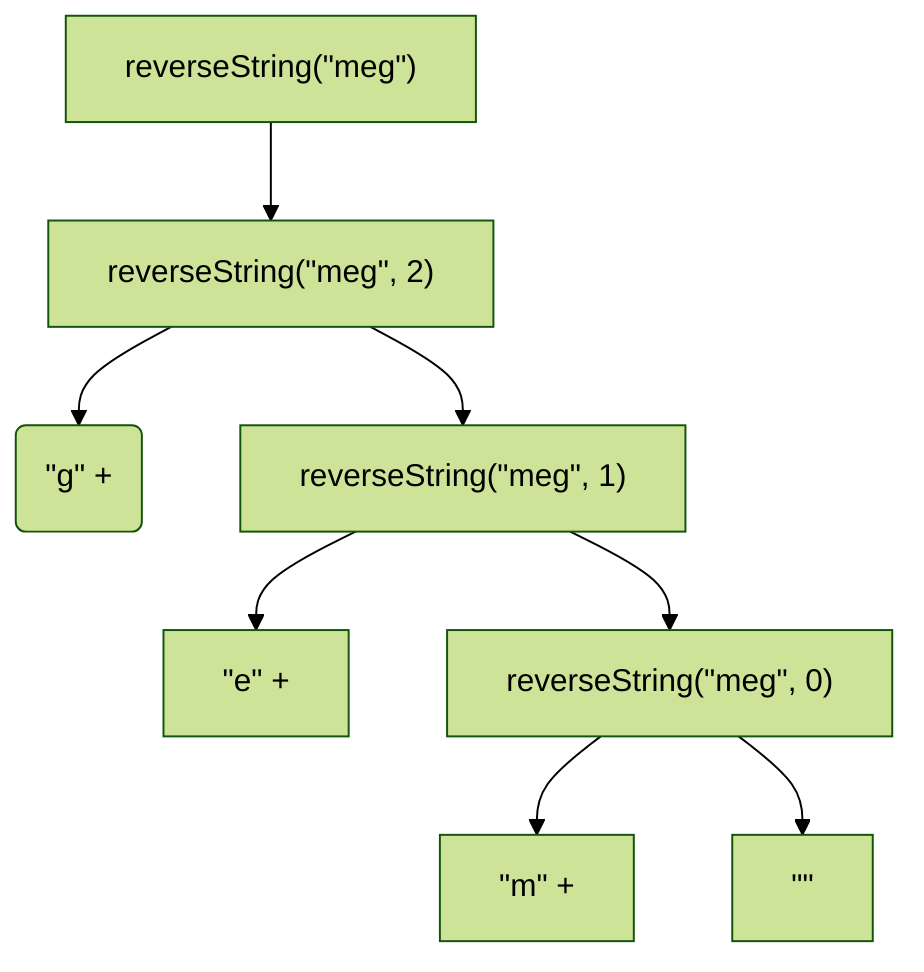
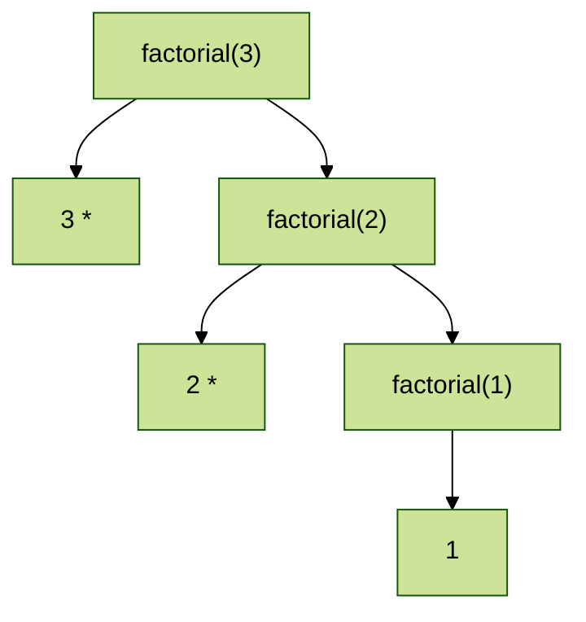
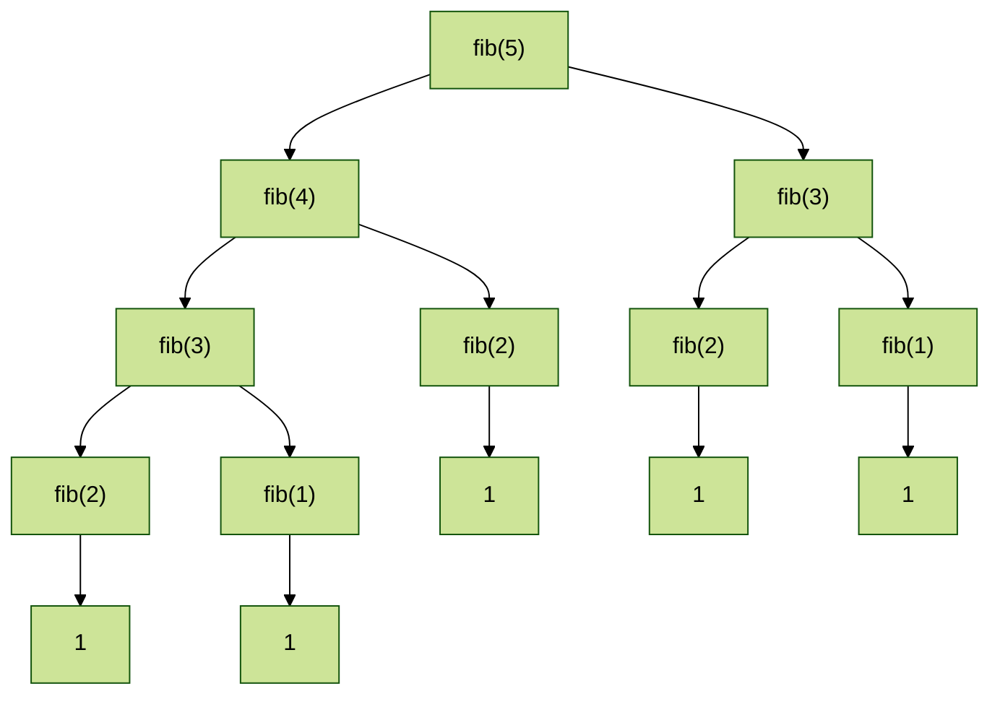
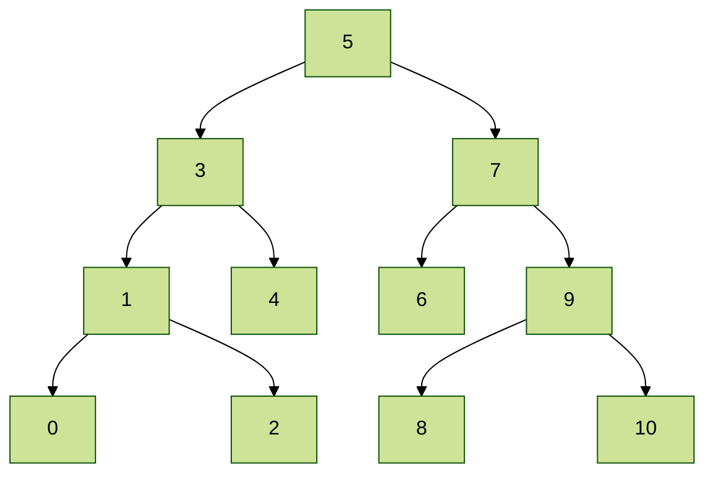
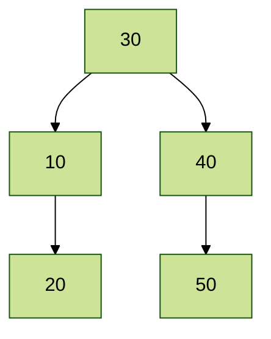

```mermaid
%%{init: {'theme':'forest'}}%%
flowchart TD
     reverseOne["reverseString(#quot;meg#quot;)"] --> reverseTwo["reverseString(#quot;meg#quot;, 2)"]
     reverseTwo --> returnOne("#quot;g#quot; +")  
     reverseTwo --> reverseThree["reverseString(#quot;meg#quot;, 1)"]
     reverseThree --> returnTwo["#quot;e#quot; +"]
     reverseThree --> reverseFour["reverseString(#quot;meg#quot;, 0)"]
     reverseFour --> returnThree["#quot;m#quot; +"]
     reverseFour --> reverseFive["#quot;#quot;"]
```

## &nbsp;

## &nbsp;

## &nbsp;

## &nbsp;

```mermaid
%%{init: {'theme':'forest'}}%%
flowchart TD
     facThree["factorial(3)"] --> rThree["3 *"]
     facThree --> facTwo["factorial(2)"]
     facTwo --> rTwo["2 *"]
     facTwo --> facOne["factorial(1)"]
     facOne --> 1
```

## &nbsp;

## &nbsp;

## &nbsp;

## &nbsp;

```mermaid
%%{init: {'theme':'forest'}}%%
flowchart TD
    fib5["fib(5)"] --> fib4["fib(4)"]
    fib5 --> fib3["fib(3)"]
    fib4 --> fib3b["fib(3)"]
    fib4 --> fib2["fib(2)"]
    fib3 --> fib2b["fib(2)"]
    fib3 --> fib1["fib(1)"]
    fib3b --> fib2c["fib(2)"]
    fib3b --> fib1c["fib(1)"]
    fib2 --> fib1b[1]
    fib2b --> fib1d[1]
    fib2c --> fib1e[1]
    fib1c --> fib1cReturn[1]
    fib1 --> fib1return[1]
```
## &nbsp;

## &nbsp;

## &nbsp;

## &nbsp;

```mermaid
%%{init: {'theme':'forest'}}%%
flowchart TD
     5 --> 3
     5 --> 7
     3 --> 1
     3 --> 4
     1 --> 0
     1 --> 2
     7 --> 6
     7 --> 9
     9 --> 8
     9 --> 10
```
## &nbsp;

## &nbsp;

## &nbsp;

## &nbsp;

```mermaid
%%{init: {'theme':'forest'}}%%
flowchart TD
    30 --> 10
    30 --> 40
    10 --> 20
    40 --> 50
```